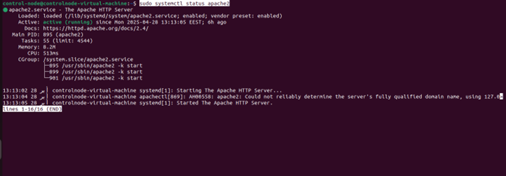
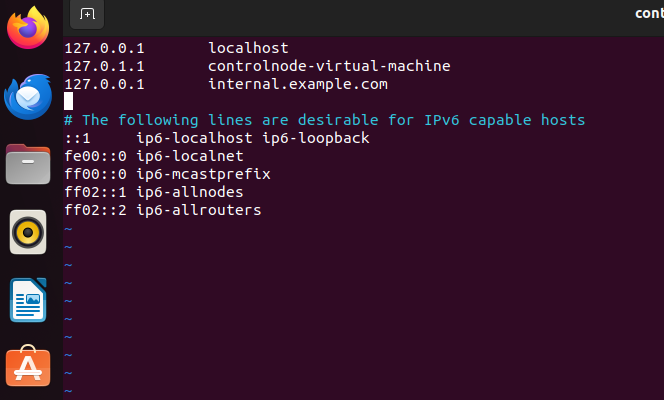
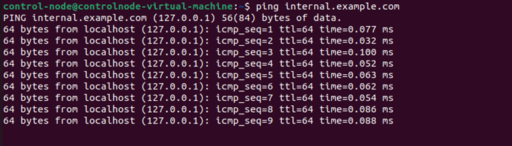
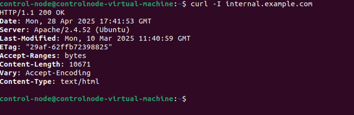
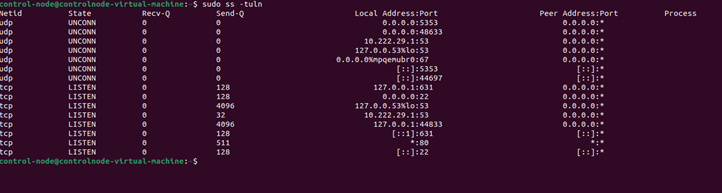

### check service avalibality 

  

### check the content of the `/etc/resolve.conf` file

### Verify DNS Resolution:
   Compare resolution from `/etc/resolv.conf` DNS vs `8.8.8.8`.

### EDIT /etc/hosts 

### check by ping 

### check curl 

### port statuse 

